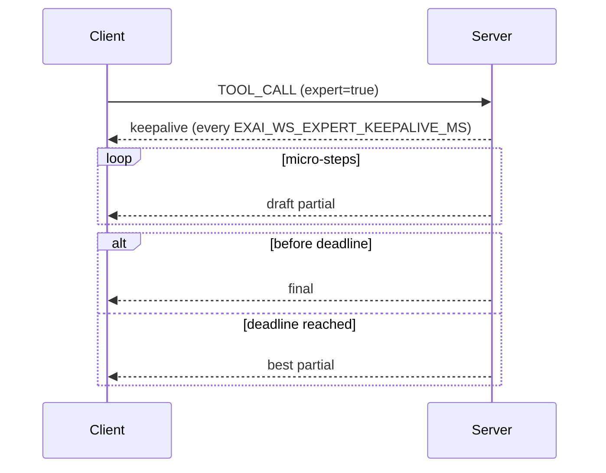

## Purpose
This document explains “what actually happens” when EXAI‑MCP tools run: which models are called, why those paths are chosen, how expert/micro‑steps affect behavior, and how outputs/errors are produced. It includes a decision tree (Mermaid) and concrete scenario notes.

## TL;DR
- Explicit model wins; otherwise tool‑specific defaults choose provider/model.
- Expert mode is stabilized by micro‑steps (draft partials) to avoid client aborts.
- Soft‑deadline alone (without micro‑steps) can time out some clients.
- Conversation threads are session‑scoped; cross‑session reuse is blocked by default.

## Components at a glance
- Tool entrypoints: chat, analyze, codereview, debug, testgen, planner, tracer, thinkdeep
- Router: resolves model/provider from request + env + tool hints
- Expert engine: micro‑step drafts vs full expert; soft deadlines; keepalive
- Memory: continuation threads, now session‑scoped with fingerprint
- Validation: SecureInputValidator (files/images), path normalization
- Logs: mcp_activity.log (TOOL_*), mcp_server.log (routing and expert phase)

## Decision tree (routing + execution)
```mermaid
flowchart TD
  A[Tool Request] --> B{Model specified?}
  B -- yes --> C[Use requested model/provider]
  B -- no --> D{Tool default?}
  D -- chat/testgen/tracer --> D1[Prefer GLM family]
  D -- analyze/thinkdeep/codereview/debug/refactor --> D2[Prefer Kimi family]
  D -- planner/general --> D3[Balanced (GLM fast \n or Kimi thorough)]
  D1 --> E[Resolve provider availability]
  D2 --> E
  D3 --> E
  E --> X{Provider up & model supported?}
  X -- no --> Y[Fallback to tool default]
  Y --> X
  X -- still no --> Z[Validation error with guidance]
  X -- yes --> E2{Expert=true?}
  E2 -- no --> F[Direct call]
  E2 -- yes --> G{MICROSTEP enabled?}
  G -- yes --> H[Run expert micro-steps \n (emit draft partials, keepalive)]
  G -- no --> I[Run full expert with soft-deadline]
  H --> J{Soft-deadline reached?}
  I --> J
  J -- yes --> K[Emit best partial + exit]
  J -- no --> L[Emit final answer]
  C --> E
```

## Mode selectors and routing rules
- Explicit selection: If `model` or `provider` is requested, the router honors it when supported.
- Tool‑guided defaults:
  - chat, testgen, tracer: default to GLM “flash” class for speed/latency.
  - analyze, thinkdeep, codereview, debug, refactor: default to Kimi for deeper reasoning.
  - planner/general: may use GLM for steps and Kimi for summary.
- Environment/feature flags:
  - EXAI_WS_EXPERT_MICROSTEP=true: enables early drafts to maintain liveness.
  - EXAI_WS_EXPERT_SOFT_DEADLINE_SECS: sets time budget for expert.
  - EXAI_WS_EXPERT_KEEPALIVE_MS: heartbeat to prevent client idle aborts.
  - EX_SESSION_SCOPE_STRICT=true: prevents cross‑session continuation.

## Expert mode behaviors
- Micro‑steps ON: Emit incremental partials; clients remain engaged and avoid aborts.
- Soft‑deadline only: Can hit client timeouts if wrapper cancels early; server submits the best partial available.
- Without expert: Direct tool execution with standard streaming; fastest but potentially shallower.

## Conversation threads
- continuation_id: global thread key augmented by session_fingerprint.
- Strict session scoping blocks accidental cross‑window contamination.
- Allowlist env can override for intentional cross‑session linking.

## Outputs and common errors
- Successful completion: TOOL_COMPLETED with final content; CI logs show provider/model.
- Partial completion: TOOL_COMPLETED with “draft/finalized” marker when deadline reached.
- Cancellation: TOOL_CANCELLED in activity log; correlate with client wrapper logs.
- Validation errors: Missing required fields (e.g., relevant_files for codereview/testgen), unsupported params.

## Recent scenario notes (examples)
- RL‑0042/50: Expert+micro‑steps stable; final responses returned within deadline.
- RL‑0043: chat file‑ingestion bug (TextContent scope) fixed by module‑level import.
- Soft‑deadline‑only tests: client aborts after ~5s in some wrappers; recommend micro‑steps ON.

## How to read the logs
- mcp_activity.log: Look for TOOL_CALL → TOOL_COMPLETED/TOOL_CANCELLED per req_id.
- mcp_server.log: Search for “Routing provider=” and “expert phase” lines; they show selected model and expert timers.

## Example: analyze (expert=true, micro‑steps ON)
1) Router chooses Kimi (no explicit model, tool=analyze).
2) Expert engine starts; micro‑step drafts streamed.
3) If deadline hits, best draft is emitted; else final analysis completes.

## Example: chat with files
1) Paths normalized via SecureInputValidator.
2) Prompt prepared; TextContent initialized (fixed in base class).
3) Router picks GLM (default); result streamed normally.

## Visual: expert timing


## Operational guidance
- Prefer micro‑steps ON for expert mode to avoid wrapper timeouts.
- Use soft‑deadline to bound cost/time; pick ≥120s for deeper tools.
- For long chats with files, prefer GLM; escalate to Kimi for deep dives.
- Keep continuation IDs unique per window; rely on session scoping for safety.

## Per‑tool breakdown

### chat
- Purpose: Conversational Q&A; supports file/image context via SecureInputValidator.
- Inputs: prompt, optional files/images, continuation_id, expert (optional).
- Outputs: Natural‑language reply; streaming where supported.
- Default routing: GLM → glm-4.5-flash (fast conversational default).
- Expert: Typically not required; can enable for complex reasoning.
- Common errors: Path validation failures; large context; rare ingestion bugs (fixed).
- Example logs: “[PROGRESS] chat: Model/context ready: glm-4.5-flash”, “MCP_CALL_SUMMARY … tool=chat … model=glm-4.5-flash”.

### analyze
- Purpose: Structured analysis (architecture, performance, security, quality).
- Inputs: step/step_number/total_steps, analysis_type, output_format, relevant_files (optional).
- Outputs: Findings with strengths/risks and actionable recommendations.
- Default routing: Kimi → kimi‑k2‑0905 (deep), sometimes GLM for short steps.
- Expert: micro‑steps recommended; soft‑deadline‑only may cause client aborts.
- Common errors: Missing context; provider unavailable; premature cancellation.
- Example logs: “Waiting on expert analysis (provider=kimi/ glm)”, “MCP_CALL_SUMMARY … tool=analyze … model=…”.

### codereview
- Purpose: Multi‑step code review with actionable findings.
- Inputs: step plan; relevant_files REQUIRED at step 1; review_type, focus_on, severity_filter.
- Outputs: Findings with severity and recommendations; diffs referenced.
- Default routing: Kimi by default for depth; GLM used for fast passes.
- Expert: Helpful for deep reviews; micro‑steps mitigate timeouts.
- Common errors: Step 1 missing relevant_files; unsupported params.
- Example logs: “MCP_CALL_SUMMARY … tool=codereview … model=glm-4.5-flash … expert=Disabled/Completed”.

### debug
- Purpose: Guided root‑cause analysis with evolving hypothesis.
- Inputs: step/step_number/total_steps; relevant_files; images/logs optional.
- Outputs: Findings + hypothesis with confidence; next_step_required control.
- Default routing: Kimi (deep tracing) or GLM for quick triage.
- Expert: Useful for complex issues; micro‑steps maintain liveness.
- Common errors: Missing evidence; over‑broad scope.
- Example logs: “MCP_CALL_SUMMARY … tool=debug … model=glm-4.5-flash … expert=Disabled/Completed”.

### testgen
- Purpose: Generate focused unit/integration tests with edge‑case coverage.
- Inputs: step/step_number/total_steps; relevant_files REQUIRED at step 1.
- Outputs: Proposed test files/cases; framework‑specific snippets.
- Default routing: GLM → glm-4.5-flash (fast scaffolding).
- Expert: Optional; use for complex systems or exhaustive coverage.
- Common errors: Missing relevant_files at step 1.
- Example logs: “MCP_CALL_SUMMARY … tool=testgen … model=glm-4.5-flash … expert=Disabled/Completed”.

### planner
- Purpose: Break down complex tasks into sequential steps with branching.
- Inputs: step; total_steps; branching/merge hints; continuation_id.
- Outputs: Step plan; optionally parallelizable branches.
- Default routing: GLM for steps; Kimi for summaries.
- Expert: Usually not necessary; enable for strategic planning.
- Common errors: Over‑broad scope; too many steps without milestones.
- Example logs: “TOOL_COMPLETED: planner …”, “MCP_CALL_SUMMARY … tool=planner … model=glm-4.5-flash”.

### tracer
- Purpose: Trace execution flow or dependencies with precision.
- Inputs: trace_mode=precision|dependencies; target_description; relevant_files.
- Outputs: Call chains, dependency maps; step results.
- Default routing: GLM for speed.
- Expert: Optional; precise tracing often runs fast without it.
- Common errors: Unsupported extra params (e.g., temperature/thinking_mode).
- Example logs: “MCP_CALL_SUMMARY … tool=tracer … model=glm-4.5-flash … expert=Completed”.

### thinkdeep
- Purpose: Multi‑stage investigation and synthesis; architecture/strategy.
- Inputs: step/step_number/total_steps; focus_areas; relevant_files.
- Outputs: Findings with hypotheses and confidence per step.
- Default routing: Kimi (deep) or GLM for quick steps; final pass often Kimi.
- Expert: Valuable for final reviews; micro‑steps recommended for long runs.
- Common errors: Overlong steps without checkpoints.
- Example logs: “MCP_CALL_SUMMARY … tool=thinkdeep … model=glm-4.5-flash/kimi‑thinking‑preview …”.

### secaudit
- Purpose: Security assessment (OWASP + compliance + infra).
- Inputs: step/step_number/total_steps; security_scope; threat_level; relevant_files.
- Outputs: Findings mapped to severities and standards; mitigations.
- Default routing: Kimi for depth.
- Expert: Recommended; use soft‑deadline + micro‑steps.
- Common errors: Missing scope; too general.
- Example logs: “MCP_CALL_SUMMARY … tool=secaudit … model=…”.

### refactor
- Purpose: Identify code smells and recommend refactoring steps.
- Inputs: step plan; refactor_type=codesmells|decompose|modernize|organization; relevant_files.
- Outputs: Prioritized refactor items with diffs/skeletons.
- Default routing: Kimi (deeper reasoning), GLM for quick scans.
- Expert: Helpful for large modules.
- Common errors: Missing relevant_files; over‑broad targets.
- Example logs: “MCP_CALL_SUMMARY … tool=refactor … model=…”.

### consensus
- Purpose: Compare/aggregate multiple model/tool stances.
- Inputs: stance control (for/against/neutral); candidate summaries; scope.
- Outputs: Consensus with rationale and divergences.
- Default routing: GLM for orchestration; Kimi for final synthesis.
- Expert: Optional unless deep reconciliation needed.
- Common errors: Incoherent inputs; missing candidates.
- Example logs: “TOOL_CALL: consensus …”, “MCP_CALL_SUMMARY … tool=consensus …”.

### status
- Purpose: Report server/tool health and configuration snapshot.
- Inputs: filters; verbosity.
- Outputs: Health summary; tool registry; versions.
- Default routing: GLM.
- Expert: Not applicable.
- Common errors: None typical.
- Example logs: “TOOL_CALL: status …”, “TOOL_COMPLETED: status …”.

### version
- Purpose: Return server/version/build info.
- Inputs: none or minimal.
- Outputs: Version string(s); provider backends.
- Default routing: GLM.
- Expert: Not applicable.
- Common errors: None typical.
- Example logs: “TOOL_CALL: version …”, “TOOL_COMPLETED: version …”.

### activity
- Purpose: Lightweight activity ping/logging utility.
- Inputs: small payload; continuation_id.
- Outputs: Ack + log trail.
- Default routing: GLM.
- Expert: Not applicable.
- Common errors: None typical.
- Example logs: “TOOL_CALL: activity …”, “TOOL_COMPLETED: activity …”.

### listmodels
- Purpose: Enumerate supported providers/models.
- Inputs: provider filter; capability filters.
- Outputs: Model list with attributes.
- Default routing: GLM.
- Expert: Not applicable.
- Common errors: Provider unavailable.
- Example logs: “TOOL_CALL: listmodels …”, “TOOL_COMPLETED: listmodels …”.

## Future evolution
- Policy‑based router: per‑tool routing policies with provider fallback chains and cost/latency targets.
- Adaptive expert engine: dynamic micro‑step cadence; budget‑aware soft deadlines; per‑client keepalive tuning.
- Unified error taxonomy: consistent validation and provider errors with actionable fixes in messages.
- Observability: richer MCP_CALL_SUMMARY including cost, tokens, model switchovers, and retry reasons.
- Profiles: "+speed" vs "+depth" toggles that influence routing, deadlines, and expert strategy per request.


## Exporting visuals
- Open docs/architecture/EXAI_MCP_Model_Routing_and_Workflow.html in your browser.
- Use the "Export ALL diagrams (PNG)" button near the top, or the per-diagram "Download SVG/PNG" buttons right below each rendered diagram.
- SVG is ideal for editing in design tools; PNG is convenient for quick sharing.
- Optional CLI (requires Node.js):
  - Install (permission required): `npm i -g @mermaid-js/mermaid-cli`
  - Export example: `mmdc -i path/to/diagram.mmd -o diagram.svg` or `mmdc -i path/to/diagram.mmd -o diagram.png`
  - If you want this wired into the repo (script + pinned version), tell me and I’ll add it after confirming install permissions.

## Appendix: default preferences (current)
- GLM family: fast/low‑latency default for conversational and lightweight tasks.
- Kimi family: deeper reasoning default for analysis/review/debug/refactor.

## Defaults table (current examples)

| Tool group | Default provider/model | Notes |
|---|---|---|
| chat, testgen, tracer | GLM → glm-4.5-flash | Low latency conversational / light tasks |
| analyze, thinkdeep, codereview, debug, refactor | Kimi → kimi-k2-0905 | Deeper reasoning; pair with micro-steps for stability |
| planner (steps) | GLM → glm-4.5-flash | Fast step planning |
| planner (summary) | Kimi → kimi-k2-0905 | Higher-quality synthesis |

Priority: explicit request > env overrides > tool defaults.

## Troubleshooting checklist
- Timeouts/Client aborts during expert:
  - Ensure EXAI_WS_EXPERT_MICROSTEP=true
  - Set EXAI_WS_EXPERT_SOFT_DEADLINE_SECS ≥ 120
  - Verify keepalive (EXAI_WS_EXPERT_KEEPALIVE_MS ~ 1500ms)
- Validation errors (e.g., codereview/testgen step 1):
  - Provide required fields such as `relevant_files`
  - Remove unsupported extra params (e.g., temperature/thinking_mode on tracer)
- Provider/model errors:
  - If explicit model unsupported, fallback to tool default or change explicit selection
  - Confirm provider is available and not throttled
- Cross-session contamination concerns:
  - Confirm EX_SESSION_SCOPE_STRICT=true and unique continuation_id per window

## Glossary
- Micro-steps: Expert sub-iterations that stream draft partials to keep clients alive
- Soft deadline: Time budget after which best-available partial is emitted
- Keepalive: Heartbeat messages preventing idle disconnects
- Continuation ID: Conversation thread identifier, now validated against session fingerprint

## Risks & mitigations
- Client wrapper cancels before expert completes → Use micro-steps + keepalive; raise client timeout to ≥150–180s if possible
- Provider throttling/outage → Fallback branch to alternate default; surface clear validation error if no provider viable
- Large file contexts in chat → Validate/normalize paths; summarize pre-ingestion when needed
- Cross-session thread merge → Strict session scoping by default; allowlist only when intentional

## Change log
## Appendix: Real log snippets (recent runs, redacted)

Example A — analyze defaults to Kimi (expert wait):
```
[PROGRESS] analyze: Waiting on expert analysis (provider=kimi)...
```

Example B — analyze defaults to GLM in some steps (expert wait, later cancellation):
```
[PROGRESS] analyze: Waiting on expert analysis (provider=glm)...
TOOL_CANCELLED: analyze req_id=329d9d77-97ec-4055-8f21-86ab4052d204
```

Example C — chat default model and readiness:
```
[PROGRESS] chat: Model/context ready: glm-4.5-flash
TOOL_COMPLETED: chat req_id=... progress=3/4
```

Example D — MCP_CALL_SUMMARY shows final model + expert mode:
```
MCP_CALL_SUMMARY: tool=analyze status=COMPLETE ... model=glm-4.5-flash ... expert=Completed
MCP_CALL_SUMMARY: tool=analyze status=COMPLETE ... model=kimi-latest ... expert=Completed
MCP_CALL_SUMMARY: tool=codereview status=COMPLETE ... model=glm-4.5-flash ... expert=Disabled
```

Notes:
- “Waiting on expert analysis (provider=…)” indicates the provider chosen for the expert phase.
- MCP_CALL_SUMMARY lines are the most reliable source for the final model string and expert status.
- Cancellation events typically arise from client-side timeouts when MICROSTEP=false; leaving MICROSTEP=true mitigates most cases.

- 2025‑09‑16: Initial version authored (Phase D).

