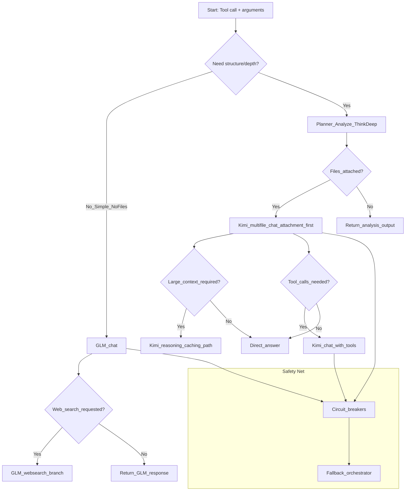

# AI Manager Decision Tree (P4 Batch 2)

- Scope: Non-operational planning. Manager remains off by default; when enabled, logs only.
- Goal: Define clear routing decisions, provider roles, and safety fallbacks without changing runtime behavior yet.

## Decision Tree (Mermaid)

## Provider roles & constraints
- GLM (manager-fast path): quick replies, websearch-capable, low cost.
- Kimi (attachment-first): robust with files, better caching/retrieval, reasoning modes when required.
- Fallback orchestrator engages on provider failure; circuit breakers prevent thrashing.

## Integration plan (no-op hooks)
- server.handle_call_tool calls AiManager.plan_or_route(tool, args) in DRY-RUN (already logs-only).
- Next phase: return advisory hints (model, websearch, attach flags) but keep default behavior unless env gates allow.

## Acceptance criteria for P4 (scaffolding stage)
- [ ] Decision tree documented (this file) with clear provider roles and fallbacks.
- [ ] Env remains off-by-default; enabling logs-only produces trace lines without changing results.
- [ ] Server restarts clean; validations pass with real model outputs and file_id paths.
- [ ] No changes to tool schemas or observable behavior for users.

## Notes
- Keep Moonshot base_url=https://api.moonshot.ai/v1.
- Maintain attachment-first policy; limit fallback inline content to 50KB.

