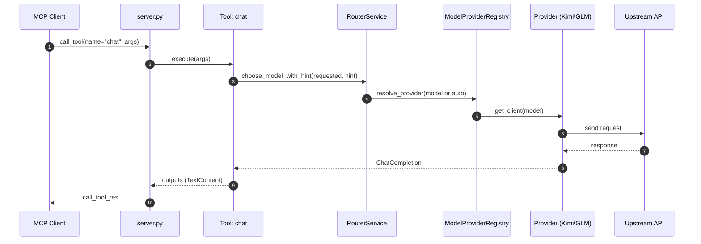
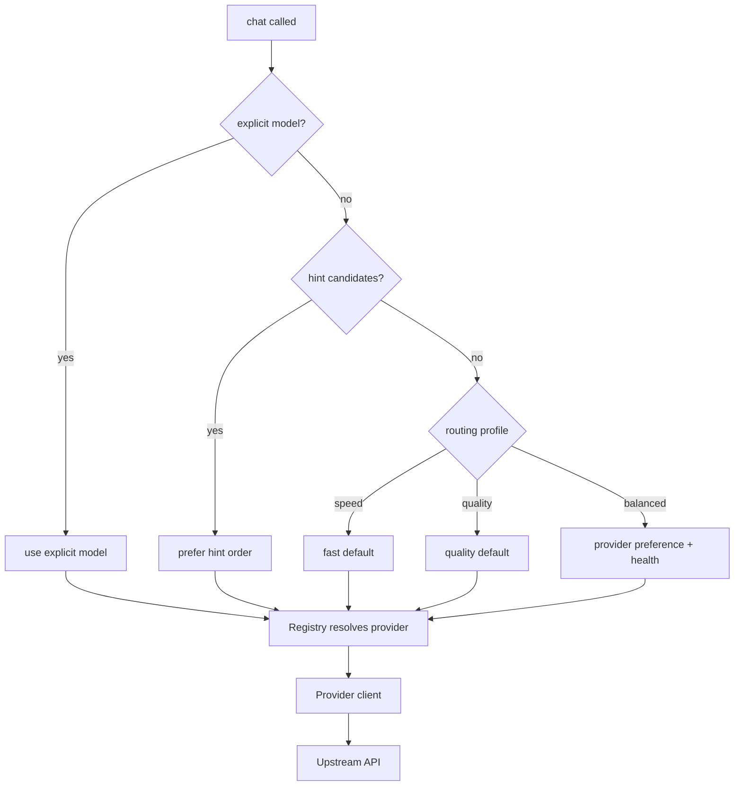

# Chat: End-to-End Flow (MCP → Router → Providers)

Status: Authoritative overview for how a chat call travels through the system and how models are selected.

## High-level sequence

## Decision flow (model selection)

## Who selects the model?
- If the tool passes an explicit `model`, that wins.
- Otherwise, `RouterService.choose_model_with_hint()` selects using (in order):
  1) Any agentic hint candidates (e.g., GLM for quick/chat; Kimi for long/context)
  2) Routing profile (`EX_ROUTING_PROFILE`: speed | balanced | quality)
  3) Provider availability/health and allowed lists
- The `ModelProviderRegistry` maps model → provider client and enforces allowlists.

## Inputs and parameters
- Tool arguments
  - `model` (optional): explicit model string. Example: `kimi-k2-0711-preview`, `glm-4.5-air`, `auto` (default)
  - `prompt` or provider-specific fields (already normalized inside the tool)
  - `thinking_mode` (optional): guides depth for think tools; chat may ignore
- Router hint
  - Internal metadata (task type, length, latency goals) may produce a hint list
  - Example hint ordering: `[glm-4.5-flash, kimi-k2-0711-preview]`

## Environment variables that affect routing
- Defaults and profiles
  - `DEFAULT_MODEL=auto` — keeps model flexible unless a tool pins it
  - `ROUTER_ENABLED=true` — activates RouterService decisions
  - `EX_ROUTING_PROFILE=balanced` — speed|balanced|quality
  - `ALLOWED_PROVIDERS=KIMI,GLM` — restricts to these providers
- Provider-specific suggested defaults (used by hints and docs)
  - `GLM_FLASH_MODEL=glm-4.5-flash`
  - `GLM_QUALITY_MODEL=glm-4.5`
  - `KIMI_DEFAULT_MODEL=kimi-k2-0711-preview`
- Provider keys and endpoints (required for real calls)
  - `KIMI_API_KEY`, `KIMI_API_URL`
  - `GLM_API_KEY`, `GLM_API_URL`
- Web search controls (when chat tools use web)
  - `KIMI_ENABLE_INTERNET_SEARCH=true`
  - `GLM_ENABLE_WEB_BROWSING=true`
- Logging/visibility (useful to verify path)
  - `EX_TOOLCALL_LOG_PATH=.logs/toolcalls.jsonl`
  - `LOG_LEVEL=INFO`, `LOG_FORMAT=json`, `ACTIVITY_LOG=true`

## Expected outcomes
- Success: Tool returns a single TextContent string with the model’s reply
- If a model is unavailable or blocked:
  - Router will choose the next candidate (hint order → profile defaults)
  - If no provider can serve, the tool returns a user-facing error message
- Logs/Signals:
  - RouterService logs the final decision and whether hint influenced it
  - Registry logs provider resolution and any allowlist/deny decisions
  - Activity and server logs show the full call path

## Quick verification steps (no restart needed)
1) Run `python scripts/validate_quick.py` — checks provider clients
2) Run `python scripts/validate_websearch.py` — end-to-end chat probes with/without web search
3) Inspect `.logs/toolcalls.jsonl` and `logs/mcp_server.log` for decision notes

