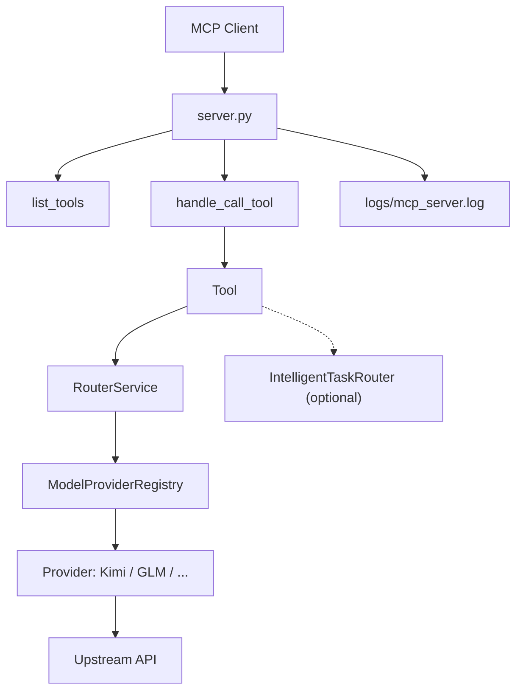

# Decision-Tree Architecture (Augment)

Status: Initial map complete — Anchored to current code

How to read this
- This is a click-first map of where things live and how a tool call flows
- Keep src/ as the system of record for application code; tools/ for MCP workflows

Top-level flow (happy path)
1) Client initializes MCP
   -> server.py: list_tools() builds dynamic Tool list (tools.registry if available, else static)
2) Client calls a tool
   -> server.py: handle_call_tool(name, arguments)
   -> Think aliasing: deepthink/\w*think\w* may reroute to thinkdeep when enabled
   -> Conversation resume/context injection (cache + reconstruct_thread_context)
   -> Executes the selected Tool's execute() with watchdog/heartbeat
3) Tool needs a model
   -> Tool selects/accepts `model` or delegates to provider registry auto-selection
   -> Providers configured lazily via server.configure_providers() (first call)
4) Provider/mode resolve
   -> src/providers/registry.py (ModelProviderRegistry) picks provider + model
   -> src/providers/<provider>.py executes the API call

Mermaid (visual)

Key anchors (files)
- Entry / orchestration: server.py — tool registry, list_tools, call dispatcher, provider configuration
- Tools: tools/ (canonical) e.g., analyze, codereview, debug, planner, thinkdeep, tracer
- Providers (canonical): src/providers/registry.py, src/providers/openai_compatible.py, src/providers/kimi.py, src/providers/glm.py
- Routing: src/router/service.py (service-level), src/core/agentic/task_router.py (agentic classifier)

Notes on duplicate domains
- See docs/augment_reports/audit/duplicate_domains_map.md for details
- Canonical choices here assume src/providers and tools/ are authoritative

## Status update — 2025-09-20
- Canonical providers tree is src/providers/*; legacy providers/* remains only as import shims during the migration window.
- Reverse shim eliminated plan: src/providers/zhipu_optional.py no longer imports providers.* (replaced with an optional SDK loader).
- Router diagnostics: src/router/service.py now supports ROUTER_DIAGNOSTICS_ENABLED=true to emit structured route_diagnostics with candidate order and provider availability.
- Next: keep tests as-is for now (some intentionally use legacy paths); block non-test imports of providers.* in CI.
