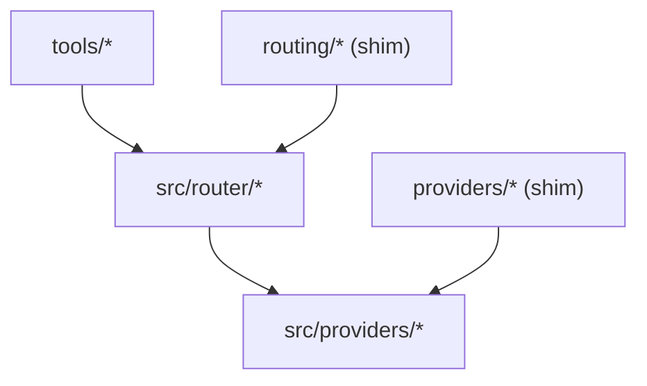

# Duplicate Domains (Visual Map)

Notes
- src/* is the source of truth; top-level providers/ and routing/ exist only as shims during migration.
- After the green window, we remove legacy trees and shims.

Additional notes (2025-09-20)
- Reverse shim removed plan: src/providers/zhipu_optional.py now provides an SDK-aware optional loader and does not import from legacy providers.*
- Router emits structured decisions; enable with ROUTER_DIAGNOSTICS_ENABLED=true for detailed candidate ordering and provider availability counts.
