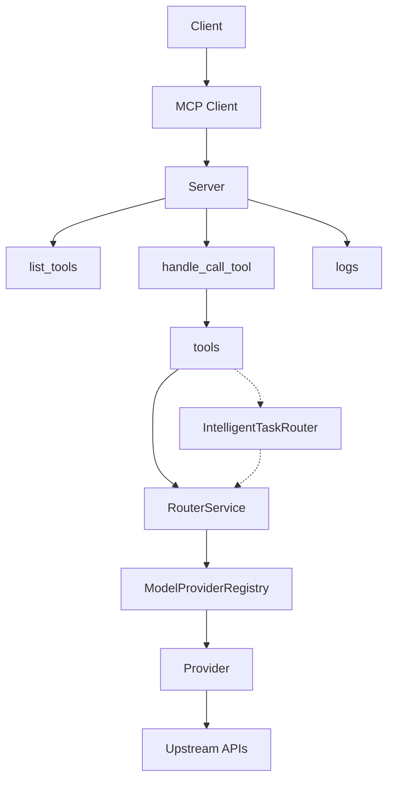

# System Flow Diagram (Augment)

Status: Visual quick reference

Notes
- src/providers is canonical for providers; top-level providers/ is a temporary shim
- Tools live under tools/ and call into RouterService when models are needed
- Agentic router is optional and should not conflict with RouterService decisions

