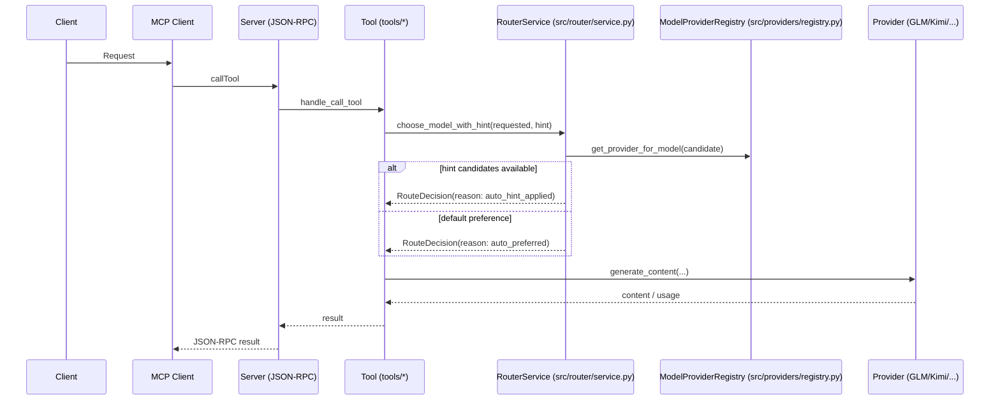

# Routing Sequence (Detailed)

Notes
- Hint is optional; when provided, RouterService logs whether hint influenced routing.
- Defaults prefer fast (GLM) then long-context (Kimi) if explicit model is not requested.

