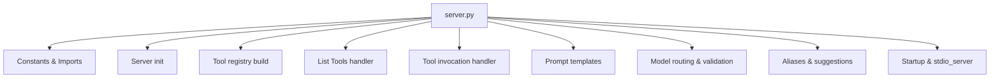

## server.py Deep Dive (2025-09-20)

### YES/NO Summary
YES — Key responsibilities mapped; modularization plan proposed to reduce future burden.

### Why this matters
server.py is large and cross-cutting (tool registry, request routing, prompts, error handling). Splitting it into smaller modules will:
- reduce coupling and cognitive load
- enable independent evolution (registry, handlers, UI wrapper)
- simplify testing and rollout of features like universal UI

### Current high-level structure


### Responsibilities (selected)
- Tool registry selection (lean registry vs fallback static TOOLS)
- Tool filtering (ESSENTIAL_TOOLS, DISABLED_TOOLS)
- MCP handlers: list_tools, tool run, prompts list
- Model routing checks, suggested model messaging, error outputs as ToolOutput
- Rerouting aliases (e.g., deepthink → thinkdeep)
- Logging and diagnostics gating

### Pain points
- Multiple concerns in one file
- Hard to patch/test isolated areas (e.g., registry vs UI wrapper vs routing)
- UI logic is entangled with tool schemas and handlers

### Proposed modularization
```
server/
  core.py                 # server init, stdio_server, base lifecycle
  registry_loader.py      # lean registry use, fallback static set, filters
  handlers/
    list_tools.py         # list tools with annotations
    run_tool.py           # invoke tools, alias resolution, ToolOutput handling
    list_prompts.py       # prompt templates exposure
  routing/
    model_suggest.py      # suggested model checks, available models logging
    aliases.py            # tool alias suggestions & reroute
  ui/
    wrapper.py            # universal ui_summary construction
  prompts/
    templates.py          # PROMPT_TEMPLATES
```

### Universal UI wrapper (in server/ui/wrapper.py)
- Takes ToolOutput + metadata; returns ui_summary dict
- Non-invasive: attached to response payloads inside run_tool handler
- Feature-flag gate (DISABLE_UNIVERSAL_UI=false)

### Migration plan
1) Extract PROMPT_TEMPLATES to prompts/templates.py (imports adjusted)
2) Move alias and model suggestion helpers to routing/*
3) Add ui/wrapper.py and integrate in run_tool handler
4) Extract list_tools, run_tool, list_prompts into handlers/*
5) Keep server/core.py minimal (startup, stdio_server)

### Verification
- list_tools, chat, analyze, thinkdeep smokes
- Validate suggested model error path still returns ToolOutput on mismatch
- Confirm ui_summary present on all tool responses

### Risks & Mitigations
- Import cycles: resolve by late imports in core or using small helper layers
- Registry timing: ensure registry_loader runs before handlers are registered
- Client compatibility: ui_summary is additive only; no schema break

