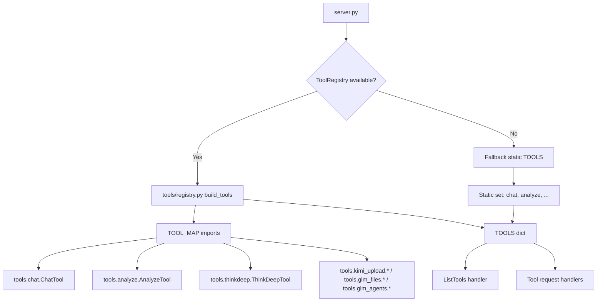

## Tools Inventory — Current State (2025‑09‑20)

### YES/NO Summary
YES — Inventory captured with likely-unused candidates identified (no moves performed).

### Scope
- Directory: tools/
- Includes: Registered tools (via tools/registry.py), internal support modules, and likely-unused/unregistered scripts.
- Source of truth for registration: tools/registry.py TOOL_MAP; server.py fallback EXACT_TOOLSET; tools/__init__.py.

### Current subfolders under tools/
- cost/
- reasoning/
- shared/
- simple/
- unified/
- workflow/

### Top-level tool entries (files) under tools/
- activity.py
- analyze.py
- autopilot.py
- browse_orchestrator.py
- challenge.py
- chat.py
- codereview.py
- consensus.py
- debug.py
- diagnose_ws_stack.py
- docgen.py
- embed_router.py
- glm_agents.py
- glm_files.py
- glm_files_cleanup.py
- health.py
- kimi_embeddings.py
- kimi_files_cleanup.py
- kimi_tools_chat.py
- kimi_upload.py
- listmodels.py
- models.py (ToolOutput and related dataclasses)
- orchestrate_auto.py
- planner.py
- precommit.py
- provider_capabilities.py
- recommend.py
- refactor.py
- registry.py (lean registry)
- secaudit.py
- selfcheck.py
- status.py
- stream_demo.py
- streaming_demo_tool.py
- streaming_smoke_tool.py
- testgen.py
- thinkdeep.py
- toolcall_log_tail.py
- tracer.py
- version.py
- ws_daemon_smoke.py

### Registered tools (authoritative)
Source: tools/registry.py TOOL_MAP + server.py fallback EXACT_TOOLSET
- Core: chat, analyze, debug, codereview, refactor, secaudit, planner, tracer, testgen, consensus, thinkdeep, docgen
- Utilities: version, listmodels, precommit, challenge
- Provider-specific: kimi_upload_and_extract, kimi_multi_file_chat, kimi_chat_with_tools; glm_upload_file, glm_multi_file_chat; glm_agent_chat, glm_agent_get_result, glm_agent_conversation
- Diagnostics/observability: provider_capabilities, toolcall_log_tail, activity, health, status
- Orchestrators/aliases: autopilot, orchestrate_auto, browse_orchestrator (hidden/gated)

### Internal/shared (not first-class tools, but used)
- models.py — ToolOutput; consumed by server and tools
- shared/* — base classes and schema builders
- simple/* — base simple tool patterns
- unified/* — chaining/framework utilities
- workflow/* — workflow base, schema builders
- reasoning/* — mode selector
- cost/* — cost optimizer and model selector

### Likely-unused or unregistered scripts (candidates)
- diagnose_ws_stack.py — No registration in TOOL_MAP; diagnostic script
- embed_router.py — Not in TOOL_MAP
- glm_files_cleanup.py — Not in TOOL_MAP
- kimi_embeddings.py — Not in TOOL_MAP
- kimi_files_cleanup.py — Not in TOOL_MAP
- recommend.py — Not in TOOL_MAP (future candidate, uses SimpleTool)
- selfcheck.py — Imported in tools/__init__.py, but not mapped in TOOL_MAP; ToolRegistry also hides “self-check” and no mapping exists; effectively not exposed
- streaming_demo_tool.py — Not in TOOL_MAP
- streaming_smoke_tool.py — Not in TOOL_MAP
- ws_daemon_smoke.py — Not in TOOL_MAP

Note: A file can still be useful as a helper/diagnostic script without being registered as an MCP tool. The list above highlights items not exposed via the registry today.

### Current registration and flow (Mermaid)

### Observations
- tools/ contains many top-level scripts (mixture of entry-tools and provider/diagnostics helpers).
- The lean registry (tools/registry.py) is the authoritative exposure point; anything not in TOOL_MAP isn’t visible to clients.
- Some scripts (diagnose_ws_stack.py, streaming_*_tool.py, *_files_cleanup.py, recommend.py) look like utilities not yet wired into the registry; consider moving under diagnostics/ or providers/maintenance/.

### Risks/Gaps
- Discoverability: mixing entry tools and helpers in the root makes it hard to see what is callable vs support.
- Consistency: provider-specific tools are mixed with general tools; grouping by provider will help trace interconnections and avoid name clashes.
- UI standardization: ThinkDeep now emits ui_summary, but a universal UI should be attached at the server layer so all tools consistently include these fields.

### Next actions (non-destructive)
- Produce reorganization proposal (separate doc) mapping each file to a subfolder, with no code moves yet.
- Decide which helpers should remain internal-only and which merit registry entries (e.g., diagnostics group with explicit gating).
- Plan a centralized, universal UI summary applied in server.py to every ToolOutput, deprecating tool-specific versions.

