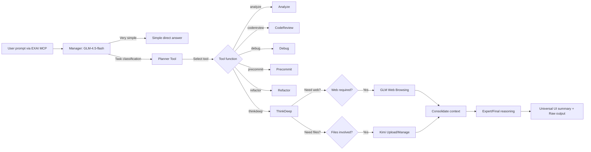
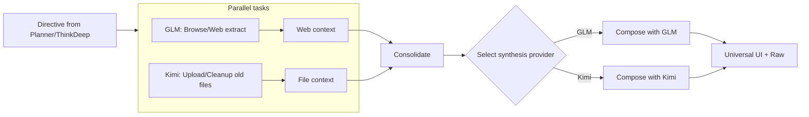

## Tools Reorganization Proposal (202509020)

### YES/NO Summary
YES 4 Proposed folderization and universal UI plan provided (no code moves performed yet).

### Design goals
- Clarity: entry-point tools separated from helpers and provider-specific scripts
- Discoverability: consistent grouping by domain (workflows, providers, diagnostics, streaming)
- Safety: non-destructive first (documentation + plan), then batch refactor with registry updates
- Compatibility: registry (TOOL_MAP) becomes the single source of truth for exposure
- UX: implement a universal UI summary at the server layer for all tools

### Proposed structure (no code moves yet)
```
tools/
  entrypoints/                  # (thin import shims; optional) names mapped in TOOL_MAP
  workflows/                    # analyze, codereview, debug, precommit, refactor, secaudit, testgen, planner, consensus, thinkdeep, tracer, docgen
  providers/
    kimi/                       # kimi_upload.py, kimi_tools_chat.py, kimi_embeddings.py, kimi_files_cleanup.py
    glm/                        # glm_files.py, glm_agents.py, glm_files_cleanup.py
  diagnostics/                  # diagnose_ws_stack.py, ws_daemon_smoke.py, toolcall_log_tail.py, health.py, status.py
  orchestrators/                # autopilot.py, orchestrate_auto.py, browse_orchestrator.py
  streaming/                    # stream_demo.py, streaming_demo_tool.py, streaming_smoke_tool.py
  capabilities/                 # provider_capabilities.py, listmodels.py (optionally stay top-level)
  shared/                       # shared/* (unchanged)
  workflow/                     # workflow/* (unchanged)
  unified/                      # unified/* (unchanged)
  reasoning/                    # reasoning/* (unchanged)
  cost/                         # cost/* (unchanged)
  registry.py                   # stays top-level (import path stability)
  models.py                     # stays top-level (server imports)
  __init__.py                   # exports entrypoint classes only
```

Notes:
- We can either keep current classes in place and add thin import shims under entrypoints/ to avoid breaking imports, or move files and update TOOL_MAP to point to new module paths.
- Registry (TOOL_MAP) remains the single exposure gate. Visibility map (core/advanced/hidden) continues to control menu size.

### Mapping: current file 3	o proposed location
- analyze.py 3	o workflows/analyze.py
- codereview.py 3	o workflows/codereview.py
- debug.py 3	o workflows/debug.py
- precommit.py 3	o workflows/precommit.py
- refactor.py 3	o workflows/refactor.py
- secaudit.py 3	o workflows/secaudit.py
- testgen.py 3	o workflows/testgen.py
- planner.py 3	o workflows/planner.py
- consensus.py 3	o workflows/consensus.py
- thinkdeep.py 3	o workflows/thinkdeep.py
- tracer.py 3	o workflows/tracer.py
- docgen.py 3	o workflows/docgen.py
- chat.py 3	o entrypoints/chat.py (optional shim) or workflows/chat.py
- listmodels.py 3	o capabilities/listmodels.py
- provider_capabilities.py 3	o capabilities/provider_capabilities.py
- autopilot.py, orchestrate_auto.py, browse_orchestrator.py 3	o orchestrators/
- toolcall_log_tail.py, health.py, status.py, diagnose_ws_stack.py, ws_daemon_smoke.py 3	o diagnostics/
- stream_demo.py, streaming_demo_tool.py, streaming_smoke_tool.py 3	o streaming/
- kimi_upload.py, kimi_tools_chat.py, kimi_embeddings.py, kimi_files_cleanup.py 3	o providers/kimi/
- glm_files.py, glm_agents.py, glm_files_cleanup.py 3	o providers/glm/
- recommend.py 3	o (defer or incubate under workflows/ or orchestrators/ when registered)
- selfcheck.py 3	o diagnostics/ (keep hidden unless explicitly enabled)

### Universal UI summary (server-level)
Problem: Only ThinkDeep emits ui_summary today; we want all tools to include a uniform UI block.

Proposal:
- Add a small wrapper in server.py after each tool response to attach a ui_summary object:
  - step_number/total_steps (if present), thinking_mode/use_websearch (if present)
  - model, duration_secs, tokens, conversation_id, expert_mode (if available)
  - output.summary_bullets (derived from text) and output.raw (full text)
- Each tool can optionally pass metadata (duration, tokens, model) via ToolOutput.metadata; the server fills missing fields.
- Keep raw output intact for logs/compliance and pipe-through; UI consumes the structured summary.

Mermaid (proposed)
```mermaid
flowchart LR
    Client -->|MCP| Server
    subgraph Server
      R[ToolRegistry] --> T((Tool Instance))
      T --> O[ToolOutput]
      O --> U[ui_summary (server wrapper)]
    end
    U --> Display[Universal UI]
    O --> Logs[(Full raw output)]
```

### Migration plan (non-destructive, in phases)
1) Document & Decide
   - Confirm proposed folders and mappings (this document)
   - Agree on universal UI fields
2) Registry-first
   - Update TOOL_MAP to new module paths or add import shims under entrypoints/
   - Keep __init__.py exporting only entry tool classes
3) Moves
   - Move files in one batched PR; run imports/CI; update any internal relative imports
   - Keep deprecation shims if needed
4) Verification
   - list_tools, run smokes (chat GLM/Kimi, thinkdeep expert/non-expert), provider tools
   - Ensure DIAGNOSTICS gating works and hidden tools don2t leak
5) Cleanup
   - Remove shims after a cooling period with green CI

### Benefits
- Clear separation of concerns (workflows vs providers vs diagnostics vs streaming)
- Faster onboarding: easier to find entry points and helpers
- Lower risk of tool-name collisions and better discoverability
- Centralized, universal UI experience across all tools

### Open questions
- Should chat live under workflows/ or remain an entrypoint?
- Do we want separate top-level capabilities/ vs keeping listmodels/provider_capabilities at entrypoints/?
- Which diagnostics should be exposed as MCP tools vs left as internal-only helpers?


---

## Reorg Proposal v2 — Manager‑first Architecture and Universal UI (2025‑09‑20)

### Summary
- Implements your "GLM‑4.5‑flash as the manager" concept with tool delegation.
- Planner decides steps; tools execute; provider orchestration runs GLM web browsing and Kimi file ingestion in parallel when needed, then consolidates.
- Universal UI summary moves to server layer so all tools emit a consistent block.

### High‑level flow (correct Mermaid)


### Provider orchestration (parallelization)


### Manager‑first routing policy
- Default manager: GLM‑4.5‑flash
  - If prompt classified as "very simple," answer directly.
  - Otherwise call Planner to propose steps and the most suitable tool function.
- Tool execution
  - Tool runs with suitable model mode (fast/balanced/quality) per routing policy and capability checks.
  - When ThinkDeep is selected and needs web/files:
    - Run GLM browsing (native SDK) and Kimi file ingestion in parallel.
    - Apply retention policy (delete files older than N days) during Kimi ingestion.
    - Choose consolidation/synthesis provider based on token size and capability (GLM vs Kimi).

### Universal UI summary (server‑level)
- Attach a ui_summary to every ToolOutput in server.py:
  - step_number, total_steps, findings (if present)
  - thinking_mode, use_websearch (if present)
  - model, duration_secs, tokens, conversation_id, expert_mode
  - output.summary_bullets (dot points) and output.raw (full text)
- Tools keep returning raw content; UI block is an additive wrapper.

### Folderization (reaffirmed)
- workflows/: analyze, codereview, debug, precommit, refactor, secaudit, testgen, planner, consensus, thinkdeep, tracer, docgen
- providers/kimi/: kimi_upload.py, kimi_tools_chat.py, kimi_embeddings.py, kimi_files_cleanup.py
- providers/glm/: glm_files.py, glm_agents.py, glm_files_cleanup.py
- diagnostics/: diagnose_ws_stack.py, ws_daemon_smoke.py, toolcall_log_tail.py, health.py, status.py
- orchestrators/: autopilot.py, orchestrate_auto.py, browse_orchestrator.py
- streaming/: stream_demo.py, streaming_demo_tool.py, streaming_smoke_tool.py
- capabilities/: provider_capabilities.py, listmodels.py
- shared/, workflow/, unified/, reasoning/, cost/ unchanged
- registry.py and models.py remain top‑level

### Duplicates/Redundancies to address
- streaming_demo_tool.py vs stream_demo.py (overlap; keep one as canonical and alias the other)
- streaming_smoke_tool.py vs ws_daemon_smoke.py (smoke overlaps; unify under diagnostics/)
- *_files_cleanup.py (GLM vs Kimi cleanup: consider a shared retention helper with provider adapters)
- embed_router.py (not registered; assess overlap with tools/registry.py and server routing logs)
- selfcheck.py (imported but not exposed via registry; keep as diagnostics‑hidden or remove if obsolete)
- browse_orchestrator.py vs orchestrate_auto.py (consolidate into orchestrators/ with a single entry)

### Implementation plan (non‑destructive first)
1) Universal UI wrapper in server.py (no file moves)
2) Registry update: optionally add import shims so TOOL_MAP remains stable while we move files
3) Single batched file reorg, fix imports, and run list_tools + smokes
4) Deduplicate streaming and diagnostics utilities; add retention helper for *_files_cleanup.py
5) Cooling period with green CI; remove shims

### Questions for you
1) For simple responses: should we enforce a max token limit threshold to decide "answer directly" vs delegate to Planner?
2) Kimi cleanup policy: retain days (default 3 as per your preference) and size limits?
3) Preferred provider for final synthesis when both CTX1 and CTX2 are large (GLM or Kimi), or route by cost cap?
4) Do you want streaming utilities consolidated into one canonical stream_demo tool and mark others as deprecated?
5) Should recommend.py be promoted (registered) as a capabilities/recommendations tool, or kept internal for now?
