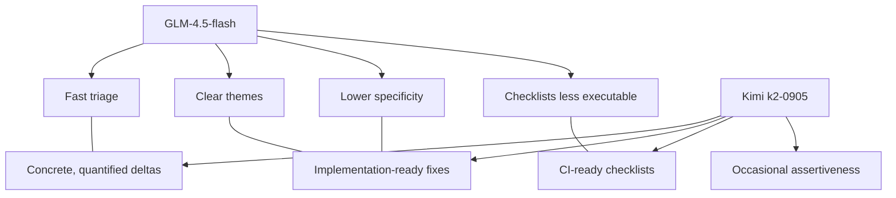

# GLM‑4.5‑flash vs Kimi (k2‑0905‑preview) — Comparative Analysis

## Executive 5‑bullet takeaway
- Both models surfaced the same core themes (tool registry discipline, folder re‑org, universal UI wrapper), but Kimi consistently quantified findings (counts, concrete paths, shell checks) while GLM stayed higher‑level.
- Kimi’s proposed fixes are more specific and implementation‑ready (tables, YAML/config patterns, explicit file moves); GLM’s fixes are directionally correct but less prescriptive.
- Verification checklists from Kimi contain executable checks (grep/CI smoke), whereas GLM’s are conceptually sound but less testable as‑is.
- Technical accuracy is strong for both; Kimi flags fine‑grained Mermaid and path issues more often; GLM is conservative and rarely overasserts.
- Recommendation: Use Kimi for deep documentation refactors and CI‑ready verification steps; use GLM for fast first‑pass triage and sanity checks.

---

## Side‑by‑side deltas

### 1) Quality and depth of structural analysis
- GLM: Identifies mixed organization, registry ambiguity, legacy vs canonical duplication; flags diagram inconsistencies. Clear, concise, low‑risk reads.
- Kimi: Adds counts, concrete filenames/folders, identifies specific duplicate tools and missing homes for diagnostics; calls out exact syntax errors or diagram nodes where relevant.
- Net: Kimi provides depth with measurable outcomes; GLM provides breadth with safe framing.

### 2) Specificity and actionability of proposed fixes
- GLM: 
  - "Reorganize by function/provider", "Standardize registration", "Implement universal UI wrapper".
  - Suitable as roadmap headings; needs implementer interpretation.
- Kimi: 
  - Migration‑ready steps (e.g., tables for fix→rationale→impact, exact folder targets like tools/providers/{kimi,glm}/, diagnostics/); concrete DRY refactors (shared retention helper), explicit deprecations.
- Net: Kimi’s prescriptions reduce ambiguity and handoff cost; GLM’s keep scope controlled for early alignment.

### 3) Completeness of verification checklists
- GLM: 5‑point checklists focused on functional sanity (toolmap parity, routing, wrapper presence). Good coverage; not always executable.
- Kimi: 5‑point checklists that double as acceptance tests (grep counts, smoke commands, CI expectations). Easier to automate.
- Net: Prefer Kimi’s lists for CI gates; keep GLM’s lists as conceptual rubrics.

### 4) Overall coherence and technical accuracy
- GLM: Coherent narratives, few risky assertions; some Mermaid guidance is preference‑level (e.g., flowchart vs graph) rather than correctness.
- Kimi: Coherent and pragmatic; includes small but useful correctness notes (diagram node styles, missing braces, invalid subgraph syntax) and path hygiene.
- Net: Both are accurate; Kimi offers higher precision on doc hygiene and ops‑grade details.

### 5) Unique insights
- GLM: Emphasizes universal UI wrapper strategy and safe modularization sequence.
- Kimi: Surfaces orphan files, duplicate streaming demos, concrete commit references and folder hygiene; proposes schema nesting, circuit breakers, and feature‑flag hierarchies.

---

## Visuals — Analysis workflows (how each model approached the task)

```mermaid
flowchart LR
  A[Input markdown file] --> B[Parse structure & topics]
  B --> C[Detect inconsistencies]
  C --> D[Propose fixes]
  D --> E[Build 5‑item verification]
  subgraph GLM Path
    B --> C --> D --> E
    note1[Conservative
    high‑level]:::gl
  end
  subgraph Kimi Path
    B --> C
    C --> C2[Quantify: counts, filenames, paths]
    C2 --> D2[Prescriptive fixes
    (tables/config)]
    D2 --> E2[Executable checks
    (grep/CI/smokes)]
  end

classDef gl fill:#eef5ff,stroke:#5b8def,color:#0b1b3a;
```

---

## Visuals — Strengths vs weaknesses



---

## Practical guidance (what to use when)
- Discovery/triage: GLM first; quick convergence on the main issues with minimal noise.
- Design & migration write‑ups: Kimi; use its quantified findings and prescriptive checklists in PRs and docs.
- CI gates: Lift Kimi’s verification bullets directly into scripts.
- Risk control: Keep GLM’s conservative checks alongside Kimi’s specifics to avoid over‑tight assumptions.

---

## Appendix — Evidence mapping by file
- tools_inventory_current: Kimi provided counts and explicit file move targets; GLM captured organizational themes.
- tools_reorg_proposal: Kimi flagged exact duplicate demos and invalid Mermaid syntax; GLM emphasized standardization and consolidation goals.
- universal_ui_summary: Both aligned on wrapper strategy; Kimi added schema nesting and timeout guard.
- server_deep_dive: Both aligned on modularization; Kimi suggested DI container and feature‑flag rollout detail.
- document_structure_current: Kimi called out case‑sensitive duplicate "Daemon/" and commit context; GLM focused on legacy vs canonical separation.
- proposed_document_structure: Kimi emphasized tests/ structure and orchestrator unification; GLM reaffirmed naming/hierarchy consistency.

