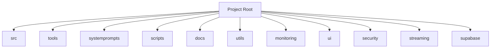
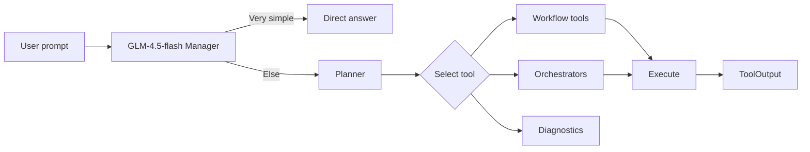
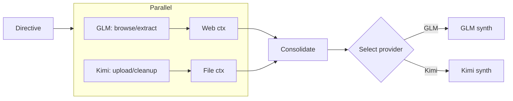

## Proposed Project Document Structure (2025-09-20)

### YES/NO Summary
YES — Proposed coherent, manageable folder design with phased migration and validation plan. Mermaid diagrams included.

### Design principles
- Single source of truth for each domain (no duplicates)
- MCP tools separated from helper layers
- `src/` is the canonical place for provider/router core logic
- `tools/` is the canonical place for MCP tool entrypoints and provider adapters
- Non-destructive migration first; shims or deletions only after validation

### Proposed top-level layout (high-level)

### src/ (canonical runtime modules)
- core/: core server plumbing, shared runtime components
- daemon/: WebSocket server, session manager
- providers/: provider interfaces and concrete adapters (glm, kimi, openrouter, zhipu, custom)
- router/: routing service entry (single source of truth)
- embeddings/: embeddings provider abstraction

### tools/ (MCP tools)
- workflows/: analyze, codereview, debug, precommit, refactor, secaudit, testgen, planner, consensus, thinkdeep, tracer, docgen
- providers/
  - kimi/: file operations and chat-with-tools wrappers
  - glm/: file operations and agents wrappers
- orchestrators/: autopilot, orchestrate_auto, browse_orchestrator (unify later)
- diagnostics/: diagnose_ws_stack, ws_daemon_smoke, toolcall_log_tail, health, status
- streaming/: stream_demo, streaming_demo_tool, streaming_smoke_tool (consolidate later)
- capabilities/: version, listmodels, provider_capabilities, models, embed_router, recommend
- helper layers (remain at tools root): shared/, workflow/, unified/, reasoning/, cost/, simple/

### Eliminate duplicate domains
- Remove legacy top-level `providers/` after confirming no imports; canonical: `src/providers/`
- Remove legacy `routing/` after confirming no imports; canonical: `src/router/`
- Remove top-level duplicate tool files (done on branch chore/registry-switch-and-docfix, commit 35f5685); canonical entries live under tools/* subfolders

### Tools registry
- TOOL_MAP points to subfolder modules (already done)
- Visibility map continues to gate core/advanced/hidden tools

### Manager-first architecture (routing only summary)

### Provider parallelization (ThinkDeep orchestration)

### Phased migration plan
1) Registry-first (done): reference subfolder modules in TOOL_MAP
2) Smoke validations on this branch: list_tools, chat, one workflow (analyze), one provider op (Kimi/GLM)
3) Root duplicate tool files already removed in this branch (35f5685); no shims needed
4) Remove legacy `providers/` and `routing/` folders (post-grep validation)
5) Consolidate orchestrators (browse_orchestrator -> autopilot)
6) Consolidate streaming utilities (canonical stream_demo)

### EXAI-WS MCP planning (manager guidance)
- Use MCP to drive sequencing and guard-rails:
  - Validate each phase with list_tools and targeted smokes
  - Keep changes additive until smokes pass on main
  - Only then remove shims/legacy folders

### Next steps (upon approval)
- Merge the registry PR; run EXAI-WS smokes
- Prepare shims PR; then legacy removal PR
- Begin orchestrator/streaming consolidation

