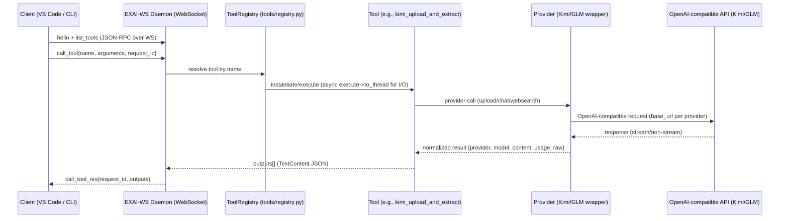
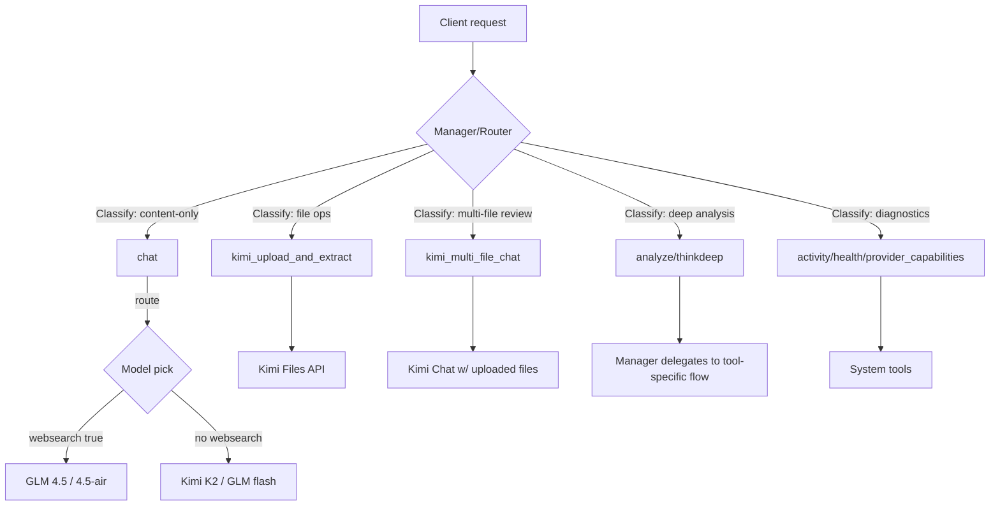

# EXAI-WS MCP — System Overview (Beta Phase)

Status: Initial snapshot — aligns with current .env and provider wiring. Will update after first backend MCP run.

## Mermaid — High-level Call Flow



## Operational Notes (current config)
- Default manager: glm-4.5-flash (DEFAULT_MODEL)
- Kimi base URL: https://api.moonshot.ai/v1 (KIMI_API_URL)
- WS ping interval/timeout: 45s / 120s; open_timeout: 60s; call_timeout: 240s
- Tool timeout: TOOL_EXEC_TIMEOUT_SEC=90 (daemon-level); KIMI chat tool web timeout=300s
- Compatibility: EXAI_WS_COMPAT_TEXT=true (monitor for UI-mapping side effects)

## What gets logged during backend runs
- WS frames: hello, list_tools, call_tool, call_tool_res (raw JSON)
- Per-call: tool name, arguments, request_id, provider/model selected, timing, preview text
- Artifacts: timestamped run folders with raw outputs + markdown summary

## Next updates
- After the first run, attach a route_diagnostics table (tool -> model -> provider -> script entrypoint)
- Add error taxonomy if cancellations occur (timeout vs. provider 4xx/5xx vs. client-side)


## Mermaid — Manager/Router Layer



## Mermaid — Tool Function Breakdown

```mermaid
classDiagram
  class chat {
    +prompt: str
    +model?: str
    +use_websearch?: bool
    +returns: TextContent[]
  }
  class kimi_upload_and_extract {
    +files: str[]
    +purpose: "file-extract"
    +returns: file_ids[], extracted_text
  }
  class kimi_multi_file_chat {
    +files: str[]
    +prompt: str
    +model?: str
    +temperature?: float
    +returns: TextContent[]
  }
  class analyze {
    +step: str
    +step_number: int
    +findings: str
    +returns: summary/detail/actionable
  }
  class activity {
    +lines?: int
    +filter?: str
    +returns: log tail
  }

  chat --> "may call" websearch
  kimi_upload_and_extract --> "uses" Kimi Files API
  kimi_multi_file_chat --> "uses" Kimi Chat + Files
  analyze --> "manager-driven orchestration"
```
