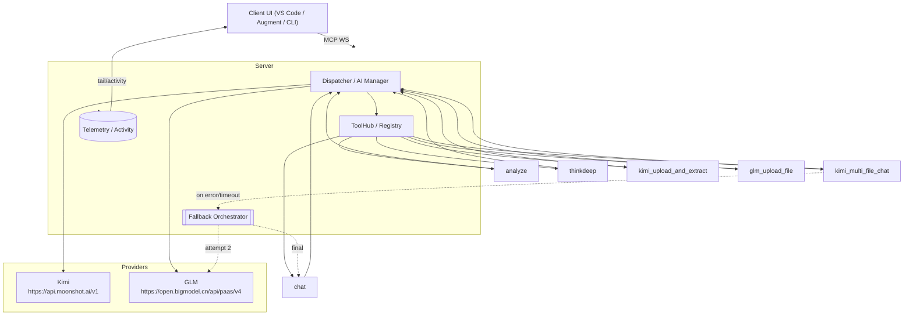

## EXAI‑WS MCP — System Overview (Beta Phase)

Top‑line (YES/NO)
YES — Diagram and status snapshot generated for manager‑first path with fallback as safety‑net.

Scope
- Server: EXAI‑WS (workstation) daemon over WebSocket
- Manager: GLM‑4.5‑flash default (router/AI‑manager role)
- Providers: Kimi (Moonshot OpenAI‑compatible), GLM (ZhipuAI)
- Tools: chat, analyze, thinkdeep, planner, codereview, debug, testgen, tracer, precommit, secaudit, kimi_upload_and_extract, kimi_multi_file_chat, glm_upload_file

Mermaid — High‑level Architecture

Operational Status (snapshot)
- Manager routing: PARTIAL — Default glm‑4.5‑flash manager active; some multi‑file chat requests may bypass orchestrator depending on entry path.
- Kimi multi‑file chat: UNSTABLE — Early cancellation after upload observed (root cause likely message construction + provider validation).
- GLM chat + browsing: OK — Responses returned and web browsing can be injected via capabilities layer.
- ThinkDeep: OK — Completes with progress and summaries.
- Analyze: OK — Multi‑step works; ensure continuation_id chaining.
- Client UI surfacing: PARTIAL — Raw frames show content; some UI paths miss final text consolidation (verify EXAI_WS_COMPAT_TEXT + envelope mapping).

Call‑flow (manager‑first)
1) UI sends call_tool(chat/analyze/thinkdeep/…)
2) Dispatcher selects provider/model (glm‑4.5‑flash default unless overridden)
3) Capability layer injects browsing tools based on use_websearch
4) Provider wrapper executes (Kimi/GLM)
5) If a multi‑file chat fails or times out: Orchestrator advances Kimi → GLM → Chat
6) Server emits progress + final envelope → UI renders

Immediate Focus
- Fix main manager path and UI surfacing; use fallback orchestrator only as safety‑net.
- Normalize envelopes and logs so UI consistently renders outputs across tools.

EXAI‑MCP summary
- Provider: Local EXAI‑WS
- Model: glm‑4.5‑flash (manager); Kimi k2 for file QA
- Cost: $0 (documentation)
- Call time: minimal
- Top‑line: YES — Diagram + status delivered.

