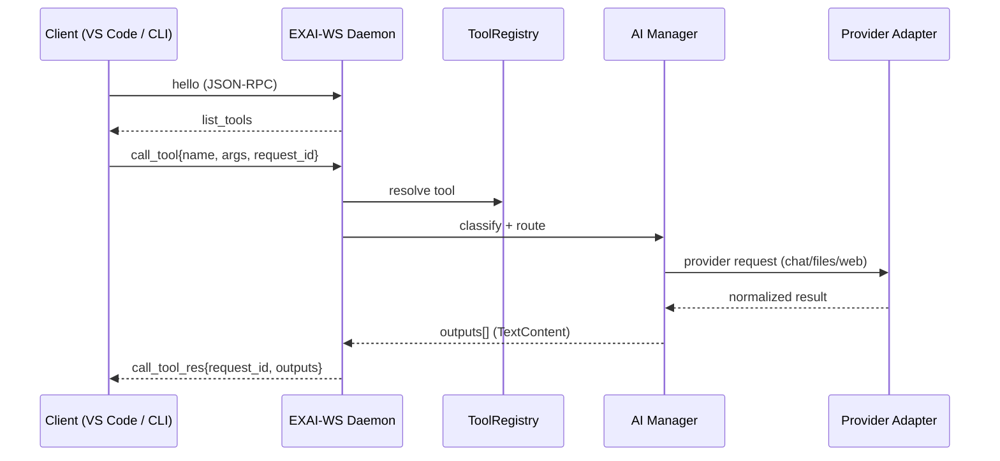
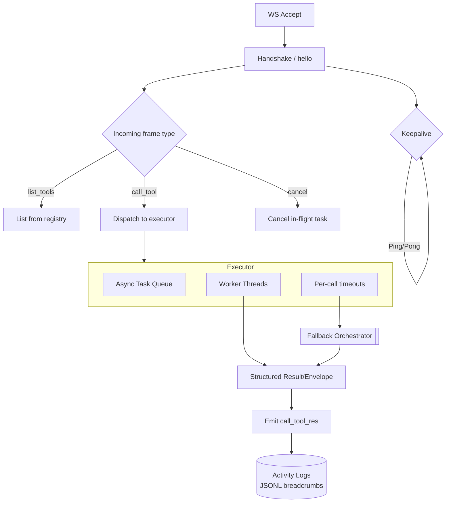
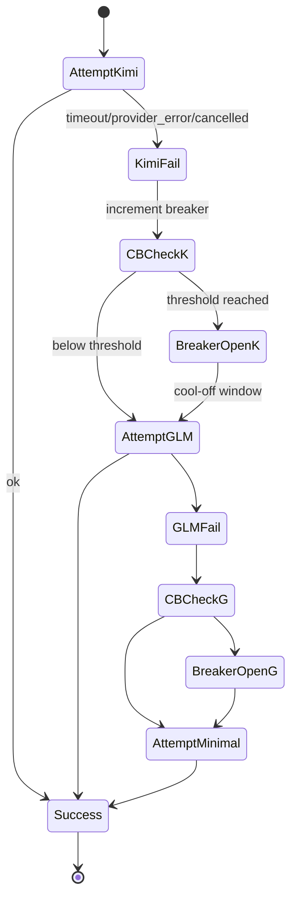
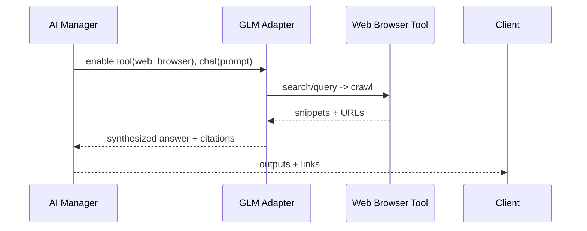
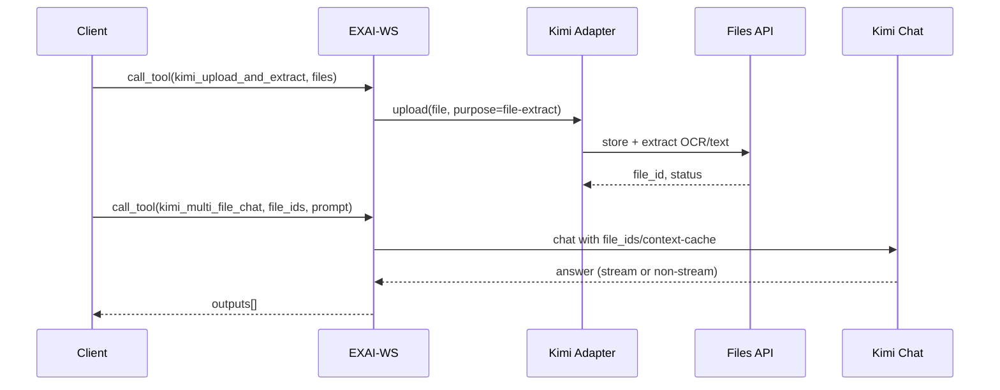
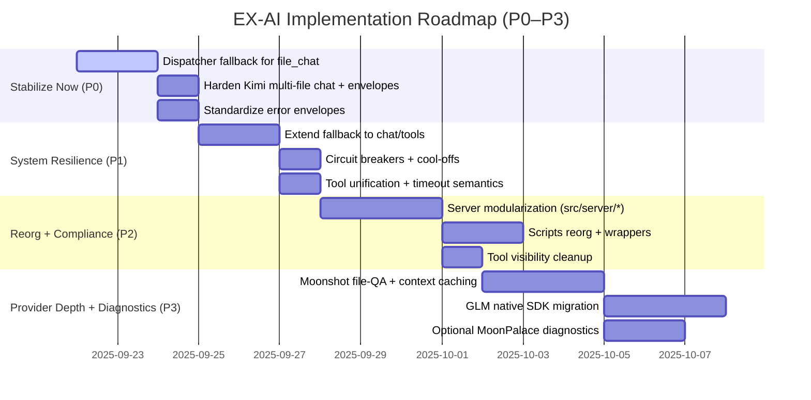

# EX-AI MCP Server — Comprehensive System Architecture

Status: Authoritative reference design for the EX-AI MCP server and AI Manager. Grounded in: platform_capabilities_research.md (2025-09-22), system_overview.md, current_errors_analysis.md, system_overview_2025-09-22.md, and implementation_roadmap.md.

---

## 1) System Architecture Overview

### 1.1 High-level System Architecture

```mermaid
flowchart TD
  %% Clients
  C1["Developer UI (VS Code, CLI, Augment)"]
  C2["Apps/Services (HTTP clients)"]

  %% Transport and Protocol
  C1 -->|MCP over WebSocket| WS((EXAI-WS Daemon))
  C2 -->|HTTP/SSE (optional)| GW[HTTP Gateway]\n(optional)
  GW --> WS

  %% Server internals
  subgraph SRV[EX-AI Server]
    subgraph CONN[Connection Layer]
      CM[Connection Manager]\n(ping/pong, timeouts)
      RPC[JSON-RPC Router]\n(MCP frames)
    end

    subgraph CORE[Core Orchestration]
      AM[AI Manager (GLM-4.5-Flash)\nClassification + Planning]
      REG[Tool Registry]\n(Discovery/Schema)
      ORCH[[Fallback Orchestrator]]
      CB[(Circuit Breakers)]
      Q[Async Task Pool]\n(threads/asyncio)
    end

    subgraph PROVIDERS[Provider Adapter Layer]
      KIMI[Kimi/Moonshot Adapter\nOpenAI-compatible + Files API]
      GLM[ZhipuAI GLM Adapter\nSDK v4 + WebBrowsing]
    end

    subgraph DATA[Shared Services]
      CACHE[(Context Cache)\nKimi cache tokens]
      EMB[(Embeddings/Index)]
      BLOB[(File Store)\nUploads/Artifacts]
      LOGS[(Telemetry)\nJSONL + Traces]
    end
  end

  WS --> CM --> RPC
  RPC --> REG
  RPC --> AM
  AM --> REG
  AM --> ORCH
  AM --> CB
  AM -->|route| KIMI
  AM -->|route| GLM
  KIMI --> CACHE
  GLM --> EMB
  KIMI --> BLOB
  GLM --> BLOB
  ORCH --> CB
  ORCH --> KIMI
  ORCH --> GLM
  WS --> LOGS
  AM --> LOGS
  ORCH --> LOGS
```

Key properties:
- Model Context Protocol (MCP) over WebSocket is the primary interface for tool discovery and invocation.
- AI Manager uses GLM-4.5-Flash as the orchestrator for request analysis, routing, and tool planning.
- Provider adapters encapsulate Kimi (Moonshot) and GLM (ZhipuAI) specifics while preserving MCP tool contracts.
- Resilience: centralized fallback orchestrator + circuit breakers minimize user-visible failures.

### 1.2 AI Manager Routing Logic (GLM4.5-Flash as Orchestrator)

```mermaid
flowchart TD
  A[Incoming MCP call_tool request] --> B[Extract intent + metadata\n (tool name, args, files, use_websearch, modality)]
  B --> C{Capability class?}
  C -->|Long-context / file QA / multi-file| D[Prefer Kimi]\n(256k ctx, Files API)
  C -->|Web browsing / real-time / agents| E[Prefer GLM]\n(web_search tool, hybrid reasoning)
  C -->|Plain chat / quick Q&A| F[GLM-4.5-Flash]\n(low-latency default)
  C -->|Coding/Tool calls| G[Pick per-tool affinity]\n(GLM strong function-calling)
  D --> H{Context size > 128k?}
  H -->|Yes| D1[Pin Kimi K2 family]
  H -->|No| D2[May use GLM if other factors favor]
  E --> I{Requires web_search?}
  I -->|Yes| E1[Enable GLM web browser tool]
  I -->|No| E2[Standard GLM chat]
  F --> J[Return route plan]
  G --> J
  D2 --> J
  D1 --> J
  E1 --> J
  E2 --> J
```

Heuristics considered: input token estimate, file count and type, latency target, browsing requirement, prior provider health (circuit breaker), and cost/usage policies.

### 1.3 Provider Selection Flow (Moonshot vs ZhipuAI)

```mermaid
flowchart LR
  S[Start] --> C1{Need long context (>128k)\nor native file extraction?}
  C1 -->|Yes| K[Kimi K2 / Kimi API]\n- 256k context\n- Files OCR/Office\n- $web_search
  C1 -->|No| C2{Need web browsing/agents\nwith hybrid reasoning?}
  C2 -->|Yes| G[GLM-4.5 / 4.5-Air / 4.5-Flash]\n- web_browser tool\n- hybrid thinking
  C2 -->|No| C3{Latency-critical or cost-sensitive?}
  C3 -->|Yes| GF[GLM-4.5-Flash]
  C3 -->|No| GM[GLM-4.5 standard]

  K -.fallback.-> G
  G -.fallback.-> GF
  GF -.final fallback.-> LocalChat[minimal chat]
```

### 1.4 MCP Protocol Flow



### 1.5 WebSocket Daemon Architecture



---

## 2) AI Manager Intelligence Flow

### 2.1 End-to-end Decision and Planning

```mermaid
flowchart TD
  S[Start] --> P1[Parse request + context]\n(tool, args, files, flags)
  P1 --> P2{Classify}
  P2 -->|File Q&A / Multi-file| R1[Kimi File Workflow]
  P2 -->|Web / Real-time| R2[GLM Browsing Workflow]
  P2 -->|Chat/Code/Tools| R3[General Workflow]

  R1 --> CWO1[Context Window Optimizer]\n(chunking, summaries, cache tokens)
  R2 --> TSEL2[Tool Selection]\n(enable web_browser, custom tools]
  R3 --> TSEL3[Function-calling set]\n(per tool schema)

  CWO1 --> ROUTE1[Route to Kimi]
  TSEL2 --> ROUTE2[Route to GLM]
  TSEL3 --> ROUTE3[Choose GLM or Kimi]

  ROUTE1 --> MON[Monitor + Telemetry]
  ROUTE2 --> MON
  ROUTE3 --> MON
  MON --> RET[Return outputs + metadata]
```

### 2.2 Decision Tree for Moonshot vs ZhipuAI

- Prefer Moonshot (Kimi):
  - Documents with heavy OCR/Office parsing, PDF tables, multi-file synthesis.
  - Prompts requiring >128k tokens of context (Kimi supports ~256k).
  - File-based QA patterns using file-id attachments and context caching tokens.
- Prefer ZhipuAI (GLM):
  - Web browsing, real-time updates, research assistant flows.
  - Agentic workflows needing reliable function-calling and hybrid “thinking” mode.
  - Latency-sensitive default responses when Flash is adequate.

### 2.3 Context Window Optimization

```mermaid
flowchart LR
  IN[Inputs: files, text, history] --> E1[Estimate tokens]
  E1 -->|>128k| K[Pin Kimi + Cache Tokens]\n(use native file-id, avoid raw dumps)
  E1 -->|<=128k| S{Summarize?}
  S -->|Yes| SUM[Hierarchical Summaries]\n(section TL;DRs)
  S -->|No| PASS[Pass-through]
  SUM --> ROUTE
  PASS --> ROUTE
```

Notes:
- Prefer provider-native file references (file-id/context-cache) instead of injecting extracted text into system messages (as per current_errors_analysis.md root cause).
- Maintain continuation_id and conversation state for multi-turn flows.

### 2.4 Tool Selection Logic

- Build a versioned tool catalog (MCP) with visibility tiers: user-facing, manager-only, backend-pathway.
- For GLM: expose web_browser and domain tools when use_websearch=true or intent classifier detects “fresh info” queries.
- For Kimi: expose Files API tools for upload/extract and multi-file chat; use provider tool-calls when supported.
- Always return standardized envelopes with: status, error_class, provider, model, tool, attempt, req_id, detail.

---

## 3) Provider Utilization Strategy

### 3.1 When to Use Moonshot (Kimi)

- Long-context reasoning (>128k tokens) across many documents.
- File-based QA with native extraction (PDF, Office, images via OCR) and cross-document synthesis.
- Context caching to reuse large prompts efficiently.
- Occasional native $web_search when Kimi remains the anchor provider and token budgets allow.

### 3.2 When to Use ZhipuAI (GLM)

- Web browsing and real-time research via web_browser tool.
- Agent workflows requiring reliable function-calling and hybrid reasoning (thinking vs non-thinking).
- Latency- or cost-constrained tasks (GLM-4.5-Flash as default manager/path).
- Multimodal (GLM-4v) for image understanding when browsing or agent tools are also needed.

### 3.3 Fallback and Error Handling Flows



Artifacts:
- JSONL breadcrumbs per attempt: {attempt, tool, provider, elapsed_ms, outcome, next}.
- Circuit breaker transitions recorded with timestamps and rolling window stats.
- Final user response includes best-effort answer and light metadata of fallbacks (for transparency).

---

## 4) Full Capability Integration

### 4.1 Native Web Search Integration (GLM primary, Kimi optional)



Guidelines:
- Use GLM web_browser by default for freshness; cap fetch depth to control token usage.
- Use Kimi $web_search only when staying within Kimi pipeline (e.g., long-context analysis anchored on Kimi).

### 4.2 File Upload and Processing Workflows (Kimi primary)



Principles:
- Prefer provider-native file_id and context-caching tokens.
- Avoid injecting raw extracted text into system messages when provider supports references.

### 4.3 Multi-modal Capabilities

- GLM-4v for image understanding; encode image as base64 or use SDK helpers; combine with web_browser if needed.
- Kimi latest supports image understanding; for document images, rely on Files OCR and then chat.

### 4.4 Tool Calling Orchestration

- Standardize function calling schemas via MCP tool catalog with JSON Schema.
- GLM: rely on native function calling; high tool-calling reliability for agent workflows.
- Kimi: align with tool-call semantics from Moonshot docs; allow parallel tool calls when beneficial.

---

## 5) Implementation Phases (Roadmap)

Aligned to implementation_roadmap.md with phased, low-risk rollout.



### 5.1 Deliverables by Phase

- P0: Working dispatcher fallback for file_chat; hardened Kimi multi-file chat; consistent error envelopes; JSONL breadcrumbs.
- P1: Fallback for chat_with_tools and plain chat; circuit breakers; normalized streaming/non-streaming error surfaces.
- P2: server.py reduced to thin glue; modular src/server/ (orchestrator, dispatcher, fallback, circuit, telemetry, conversations, registry_bridge); script wrappers and READMEs.
- P3: Kimi compliant file QA with context caching; GLM via native SDKs for web search/files/agents; optional MoonPalace traces.

---

## 6) Security, Observability, and Reliability

- Security: fine-grained tool permissions; secrets isolation in provider adapters; audit trails for tool invocations.
- Observability: unified activity logs, JSONL attempt breadcrumbs, circuit breaker state logs, correlation via req_id.
- Reliability: per-call timeout budget, retry-with-backoff where safe, fallback chains, half-open probes after cool-offs.

---

## 7) Configuration and Defaults

- Default manager: GLM-4.5-Flash (orchestrator, low-latency).
- Timeouts: WS ping 45s / timeout 120s; tool exec default 90s; Kimi web ops up to 300s when file flows involved.
- Compatibility: EXAI_WS_COMPAT_TEXT=true for UI mapping of outputs.

---

## 8) Appendices

### 8.1 Provider Feature Snapshot (from research)

- Moonshot Kimi:
  - ~256k context; Files API for OCR/Office; native $web_search; tool-calling; streaming.
- ZhipuAI GLM:
  - 128k context (series variants); hybrid reasoning (thinking/non-thinking); reliable function-calling; web browser tool; GLM-4v multimodal.

### 8.2 References

- System documents: system_overview.md; system_overview_2025-09-22.md; current_errors_analysis.md; implementation_roadmap.md
- Research: platform_capabilities_research.md (2025-09-22)
```
As per Moonshot docs: https://platform.moonshot.ai/
As per ZhipuAI docs: https://docs.z.ai/guides/llm/glm-4.5
```
